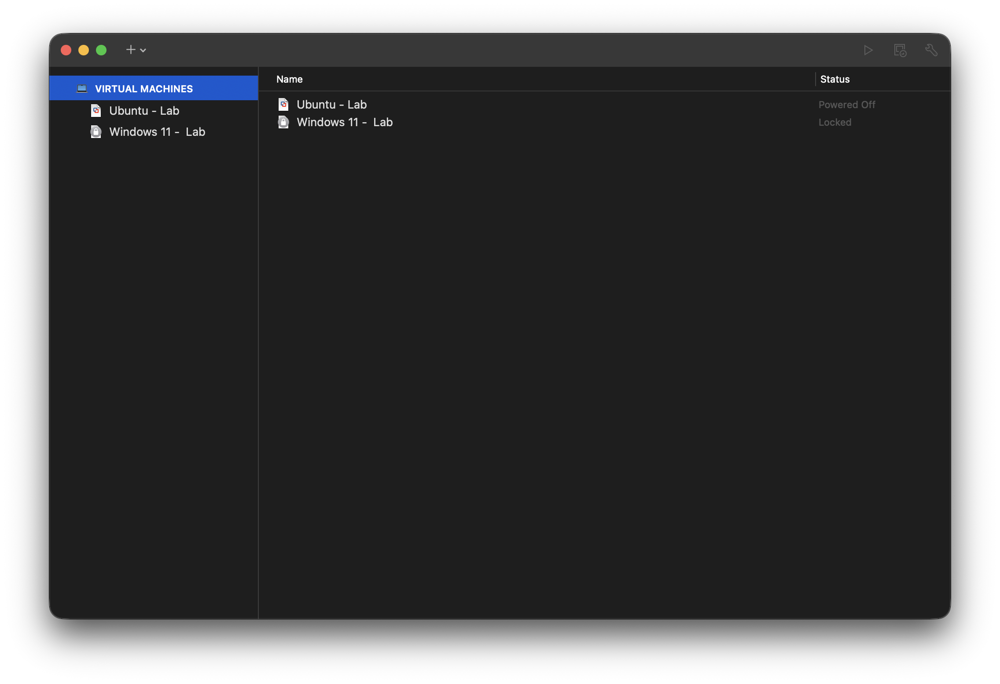

# IT Home Lab

This repository documents my personal IT home lab as I build hands-on experience with virtualization, operating systems, networking, and troubleshooting.

## Lab Environment

### Hardware
- MacBook Pro 14-inch
- Apple M1 Pro
- 16 GB RAM
- 512 GB internal storage
- SanDisk Extreme Pro 1 TB external SSD

### Virtualization
- VMware Fusion
- Windows 11 Pro
- Ubuntu Linux

## Current Lab Setup

My virtual machines are configured using VMware Fusion on macOS. VM files are stored on an external SSD to reduce storage usage on the MacBook's internal drive.

### Virtual Machine Environment

Windows 11 Pro and Ubuntu Linux are configured as separate virtual machines in VMware Fusion.

### Windows 11
- Windows 11 Pro virtual machine
- VM stored on external SSD
- 128 GB virtual disk
- Tested VM dependency on external storage
- Configured virtual hardware and installation media

### Ubuntu Linux
- Ubuntu Linux virtual machine
- VM stored on external SSD
- Ubuntu desktop environment installed
- Linux terminal configured and tested
- SSH configured for remote access from macOS
- Practicing Linux/Unix and Bash commands

## Documentation

### Windows
- [Windows 11 VM Setup](windows/setup.md)

### Linux
- [Ubuntu VM Setup](linux/setup.md)
- [macOS to Ubuntu SSH](linux/ssh.md)

## What I'm Learning
- Virtual machine configuration
- Windows administration
- Linux/Unix fundamentals
- External VM storage management
- SSH and remote administration
- Networking fundamentals
- System troubleshooting

## Project Status

This home lab is an ongoing project. Additional configurations, troubleshooting notes, networking exercises, scripts, and cybersecurity labs will be documented as the environment develops.
