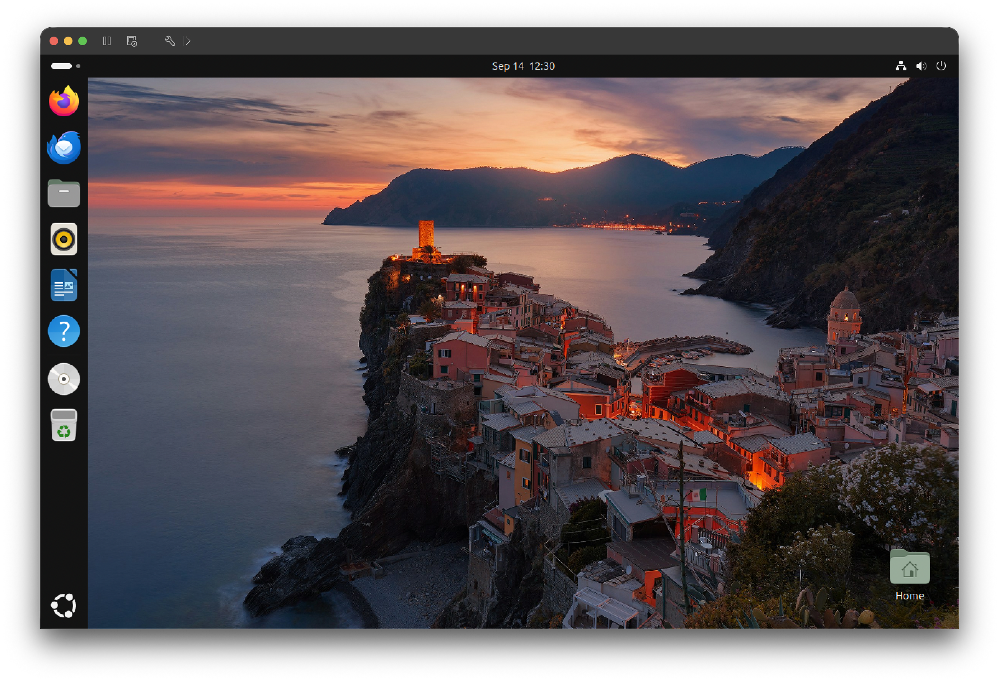
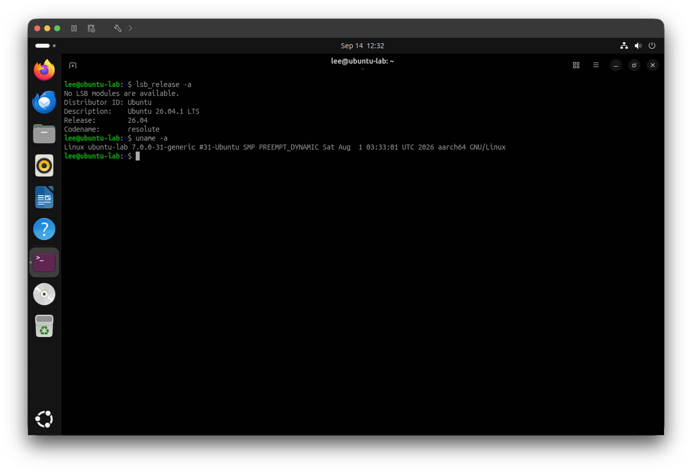
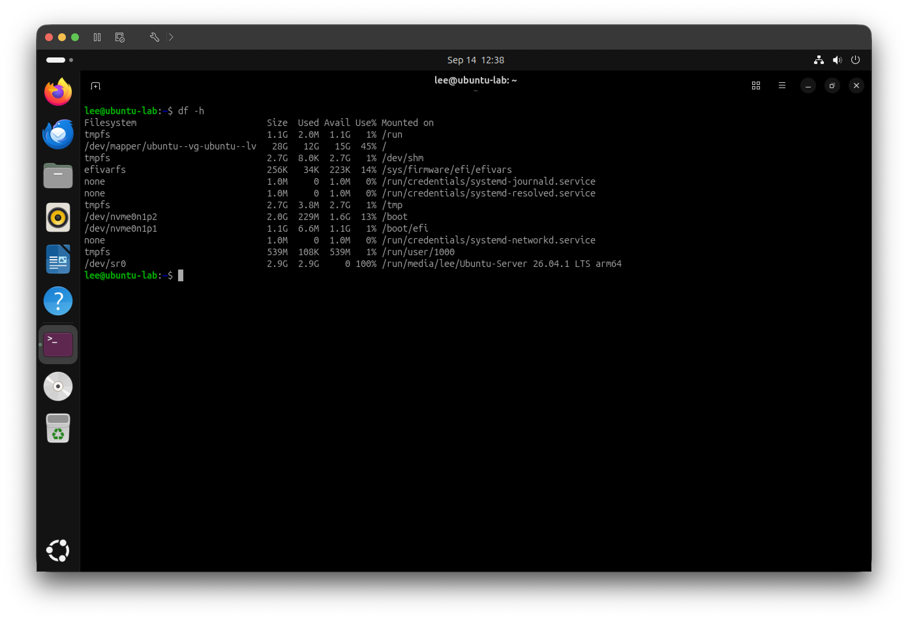
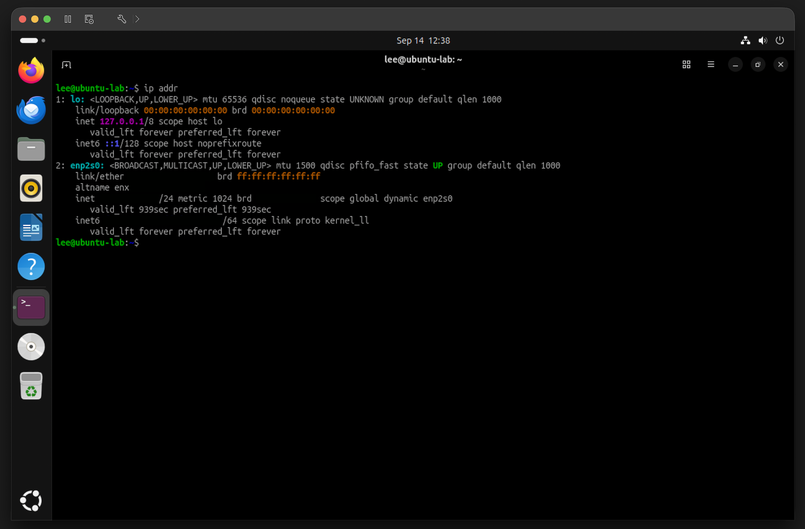

# Ubuntu VM Setup

Documentation for my Ubuntu Linux virtual machine running in VMware Fusion.

## Environment

- Host: macOS
- Hypervisor: VMware Fusion
- Guest OS: Ubuntu Linux
- VM Storage: SanDisk Extreme Pro 1 TB external SSD

## Setup

Ubuntu was installed as a separate virtual machine in VMware Fusion.
The Ubuntu desktop environment and Terminal are configured and operational.

## Current Usage
I am using the Ubuntu VM to practice:
- Linux and Unix fundamentals
- Bash commands
- File system navigation
- Package management
- Networking
- SSH
- Remote administration

## Verification

The following screenshots verify the Ubuntu VM configuration and system environment.

### Ubuntu VM

Ubuntu running successfully in VMware Fusion.

### System Information

Ubuntu system information used to verify the operating system and virtual environment.

### Storage

Ubuntu storage information used to verify the VM's virtual disk configuration.

### Networking

Ubuntu network information used to identify the VM's network interface and IP address.

