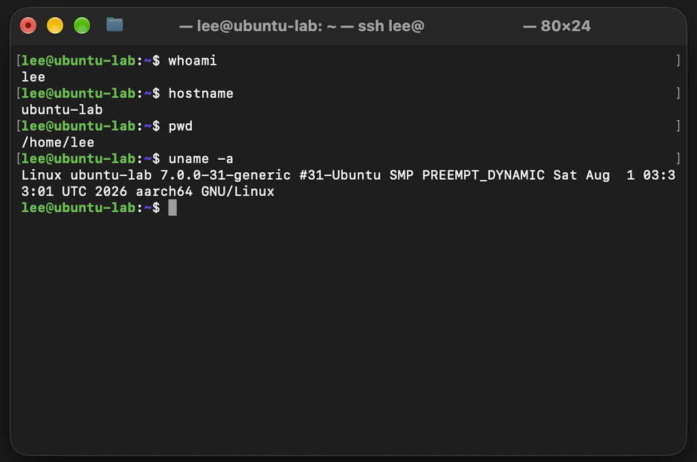

# SSH: macOS to Ubuntu

## Overview
Configured SSH access from the macOS Terminal to an Ubuntu virtual machine running in VMware Fusion.

This allows the Ubuntu VM to be managed remotely from the Mac command line while the VM is running.

## Environment
Component	System: 
- SSH Client:	macOS Terminal
- SSH Server:	Ubuntu Linux VM
- Hypervisor:	VMware Fusion
- Protocol:	SSH
- Default Port:	TCP 22

### Connection Flow

```text
macOS
│
│  SSH Client
│
│  Connect to Ubuntu IP
│  using SSH over TCP port 22
│
▼
Ubuntu VM
│
│  OpenSSH Server (sshd)
│  receives connection
│
▼
Authentication
│
▼
Ubuntu Linux Shell
```

- The Mac acts as the SSH client and connects to the Ubuntu VM using its IP address. SSH uses TCP port 22 by default,
where TCP provides reliable communication and port 22 identifies the SSH service. The OpenSSH server (sshd) on Ubuntu receives the connection,
authenticates the user, and provides access to the Linux shell.

## 1. Install OpenSSH Server
On the Ubuntu VM:

```bash
sudo apt update
sudo apt install openssh-server
```
`apt update` refreshes the available package information, while `openssh-server` installs the SSH service required to accept remote connections.

## 2. Verify the SSH Service
Check whether SSH is running:

```bash
sudo systemctl status ssh
```

Expected status: 

```text
Active: active (running)
```

The SSH server must be running before another system can connect to the Ubuntu VM.

## 3. Find the Ubuntu IP Address

Run:

```bash
hostname -I
```
The returned IP address identifies the Ubuntu VM on the network.

It can also be viewed with:

```bash
ip addr
```

## 4. Connect from macOS

Open Terminal on the Mac and run:

```bash
ssh <username>@<ubuntu-ip>
```

Example format:

```bash
ssh user@192.168.x.x
```

On the first connection, SSH may ask whether to trust the remote host. After accepting the host key and entering the Ubuntu account password, the Mac Terminal opens a shell session on Ubuntu.
Linux does not display characters or asterisks while entering a password in the terminal. This is normal behavior.

## 5. Verify the Remote Session

After connecting, run:

```bash
whoami
hostname
uname -a
```

These commands verify the remote session:

**Command / Purpose** 

- `whoami` - Shows the currently logged-in user

- `hostname` - Shows the name of the remote system

- `uname -a` - Displays Linux system and kernel information

If the output identifies the Ubuntu VM, commands entered through the Mac Terminal are being executed remotely on Ubuntu.

## 6. End the SSH Session

To disconnect:

```bash
exit
```

This closes the SSH session and returns the terminal to the local macOS shell.

## Result

- SSH access between macOS and the Ubuntu VM was successfully configured and tested.
- The Ubuntu VM can now be administered from the macOS Terminal without interacting directly with the Ubuntu desktop interface.

## What I Learned

* How SSH uses a client/server model for remote access
* How to install and verify a Linux system service
* How IP addresses identify systems on a network
* How to establish an authenticated SSH session
* How to distinguish between local and remote shell sessions
* How macOS Terminal can be used to administer a Linux system

### Verification

The following screenshot shows a successful SSH connection from the macOS Terminal to the Ubuntu VM.


