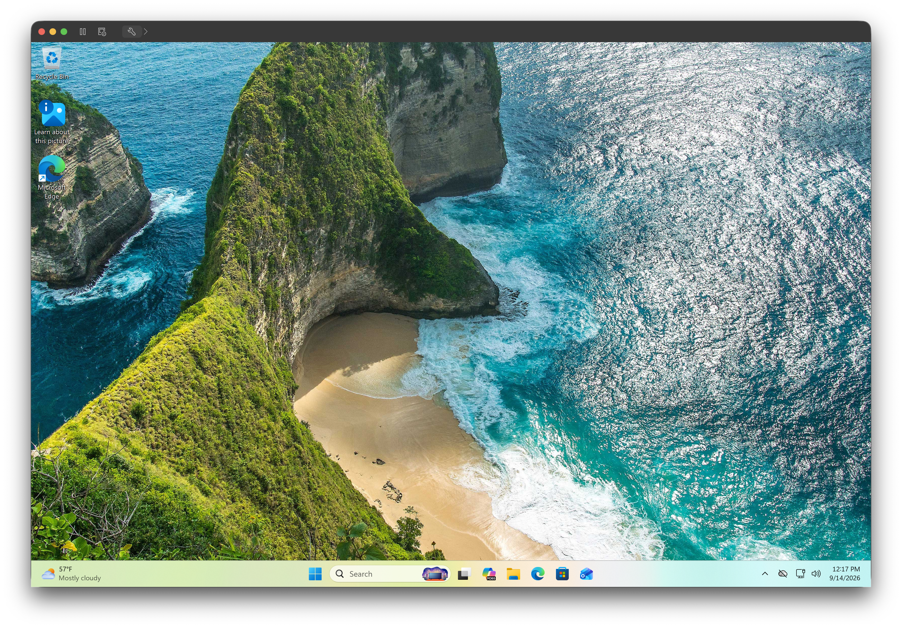
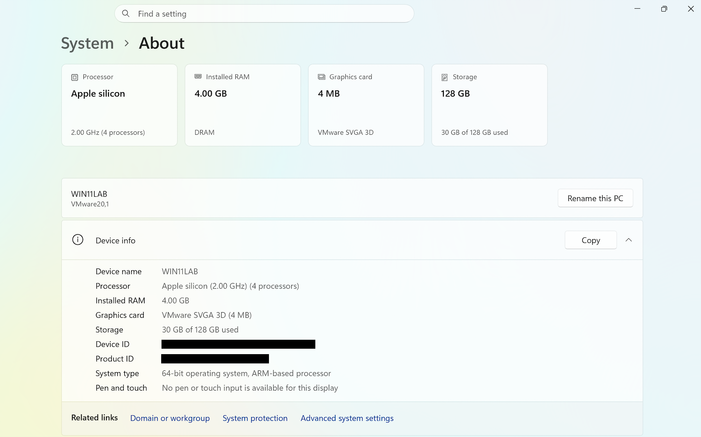
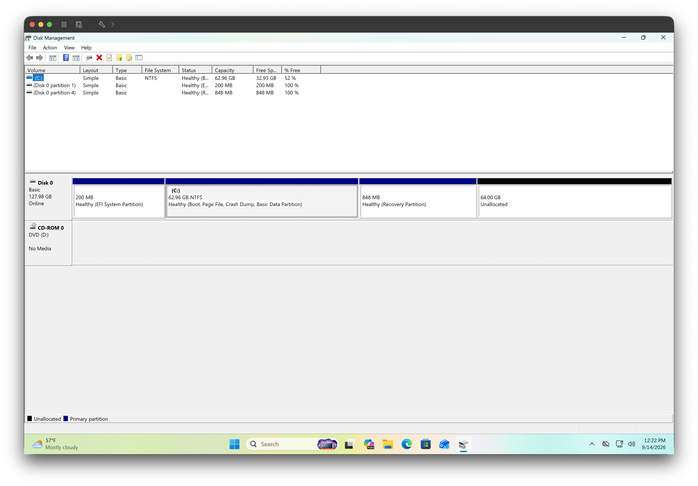

# Windows 11 VM Setup

Documentation for my Windows 11 Pro virtual machine running in VMware Fusion.

## Environment

- Host: MacBook Pro 14-inch
- Processor: Apple M1 Pro
- Hypervisor: VMware Fusion
- Guest OS: Windows 11 Pro
- VM Storage: SanDisk Extreme Pro 1 TB external SSD

## Setup

Windows 11 Pro was configured as a virtual machine using VMware Fusion. The VM files are stored on the external SSD instead of the MacBook's internal storage.
The virtual machine was configured with a 128 GB virtual disk. This storage exists as part of the VM files stored on the external SSD.

## Verification

Verified the VM storage location by disconnecting the external SSD and attempting to launch the virtual machine. VMware Fusion could not locate the VM until the external SSD was reconnected.
This confirmed that the Windows VM files were stored on the external SSD.

The following screenshots verify the Windows 11 VM configuration and virtual storage.

### Windows 11 VM

Windows 11 Pro running successfully in VMware Fusion.

### System Information

Windows system information used to verify the operating system and system configuration.

### Virtual Disk

Windows reports a 128 GB virtual disk configured through VMware Fusion. The virtual disk exists as part of the VM files stored on the external SSD.

